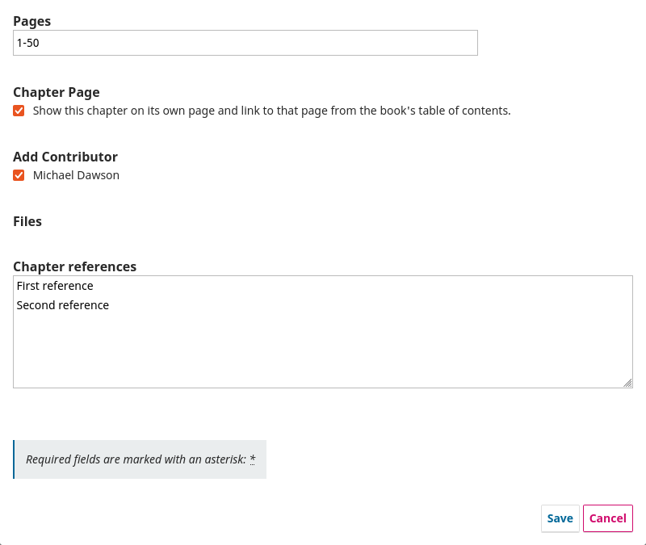
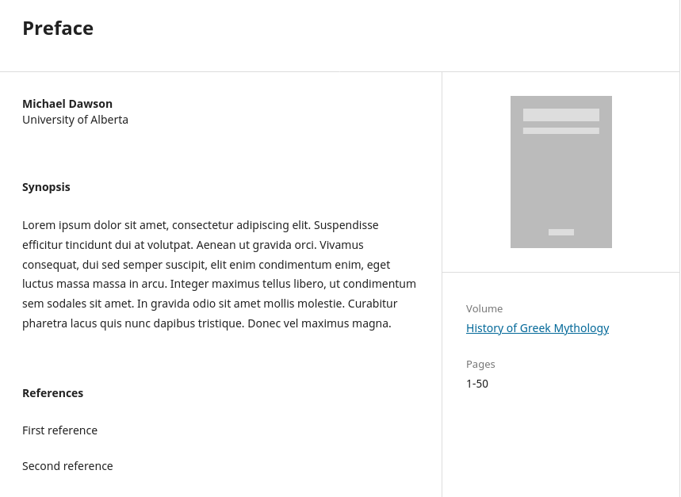

# References for Chapters Plugin 

This plugin allows the adding of references for monograph chapters in OMP.

## Compatibility

The latest release of this plugin is compatible with the following PKP applications:

* OMP 3.4.0

## Plugin Download

To download the plugin, go to the [Releases page](https://github.com/lepidus/referencesForChapters/releases) and download the tar.gz package of the latest release compatible with your website.

## Installation

1. Enter the administration area of ​​your OMP website through the __Dashboard__.
2. Navigate to `Settings`>` Website`> `Plugins`> `Upload a new plugin`.
3. Under __Upload file__ select the file __referencesForChapters.tar.gz__.
4. Click __Save__ and the plugin will be installed on your website.

## Usage

After installing and enabling the plugin, a new field will be displayed in the form used to create/edit chapters. Its functioning is similar to the submission's references field.

To display the chapter references in the chapter page, it's necessary to add a little adjustment in the OMP theme being used. Here is an example of the references being displayed in the Default theme, after the change:

# License
__This plugin is licensed under the GNU General Public License v3.0__

__Copyright (c) 2025 Lepidus Tecnologia__
