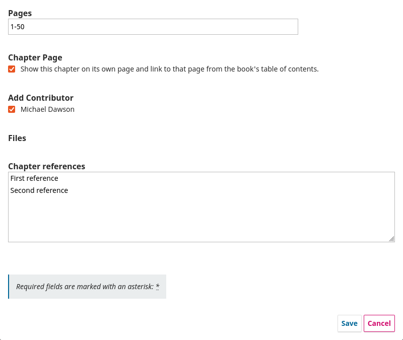
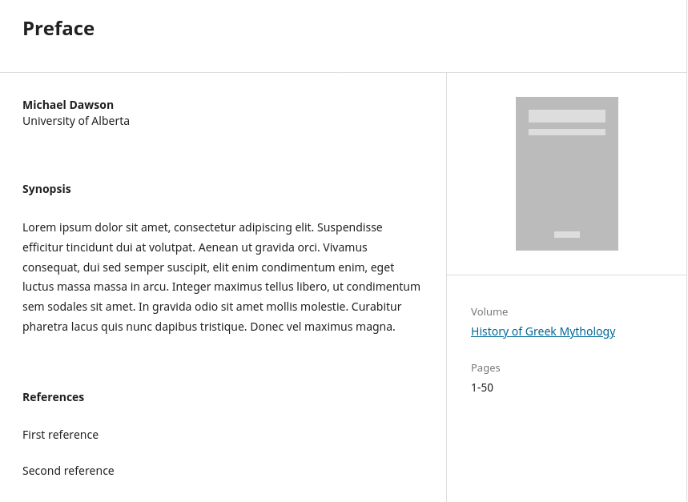

**Português Brasileiro** | [English](/README.md) | [Español](/docs/README-es.md)

# Plugin Referências para Capítulos

Este plugin permite a adição de referências para capítulos de monografias no OMP.

## Compatibilidade

A versão mais recente deste plugin é compatível com as seguintes aplicações PKP:

* OMP 3.4.0

## Download do Plugin

Para baixar o plugin, acesse a [Página de Versões](https://github.com/lepidus/referencesForChapters/releases) e baixe o pacote tar.gz da versão mais recente compatível com o seu site.

## Instalação

1. Acesse a área de administração do seu site OMP através do __Painel de Controle__.
2. Navegue até `Configurações` > `Website` > `Plugins` > `Carregar um novo plugin`.
3. Em __Carregar arquivo__, selecione o arquivo __referencesForChapters.tar.gz__.
4. Clique em __Salvar__ e o plugin será instalado em seu site.

## Uso

Após instalar e habilitar o plugin, um novo campo será exibido no formulário utilizado para criar/editar capítulos. Seu funcionamento é semelhante ao campo de referências da submissão.



---

O plugin adiciona uma nova seção à página do capítulo, exibindo as referências do capítulo ao final da seção principal. Isso só ocorre se o Tema Padrão estiver sendo utilizado, conforme mostrado abaixo.



Para exibir as referências do capítulo na página do capítulo em outros temas, é necessário fazer um pequeno ajuste no tema OMP utilizado. Você precisará adicionar o seguinte trecho de código ao arquivo `templates/frontend/objects/chapter.tpl`, adicionando-o na posição em que deseja exibir as referências.

```smarty
{* Chapter references *}
{if $chapterCitations || $chapter->getData('chapterCitationsRaw')}
    <div class="item references">
        <h2 class="label">
            {translate key="submission.citations"}
        </h2>
        <div class="value">
            {if $chapterCitations}
                {foreach from=$chapterCitations item=$chapterCitation}
                    <p>{$chapterCitation->getCitationWithLinks()|strip_unsafe_html}</p>
                {/foreach}
            {else}
                {$chapter->getData('chapterCitationsRaw')|escape|nl2br}
            {/if}
        </div>
    </div>
{/if}
```

# Licença
__Este plugin é licenciado sob a GNU General Public License v3.0__

__Copyright (c) 2025 - 2026 Lepidus Tecnologia__
